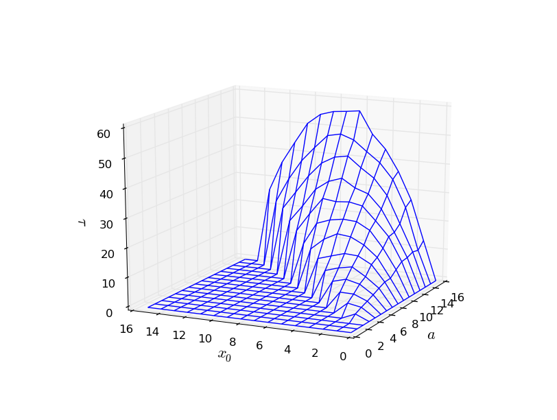
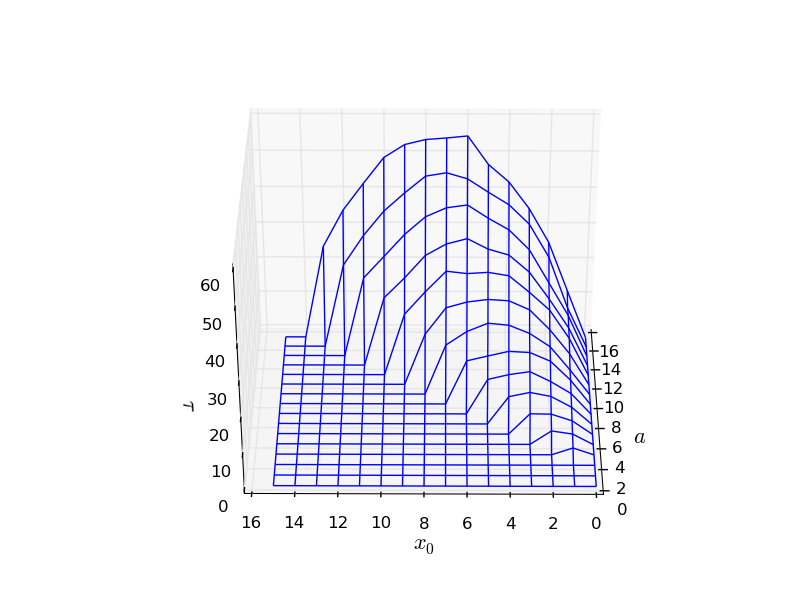
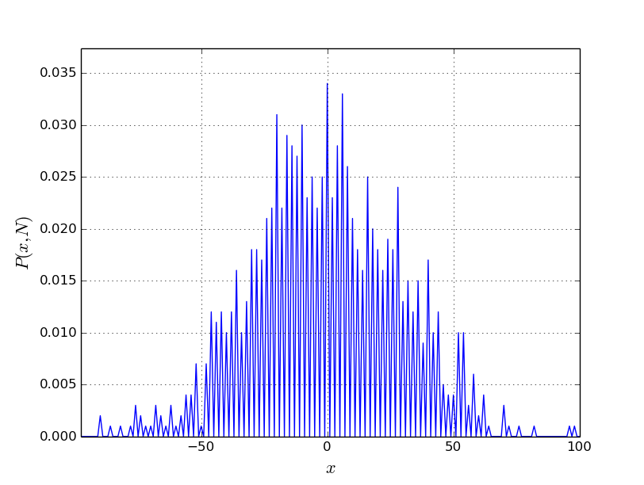
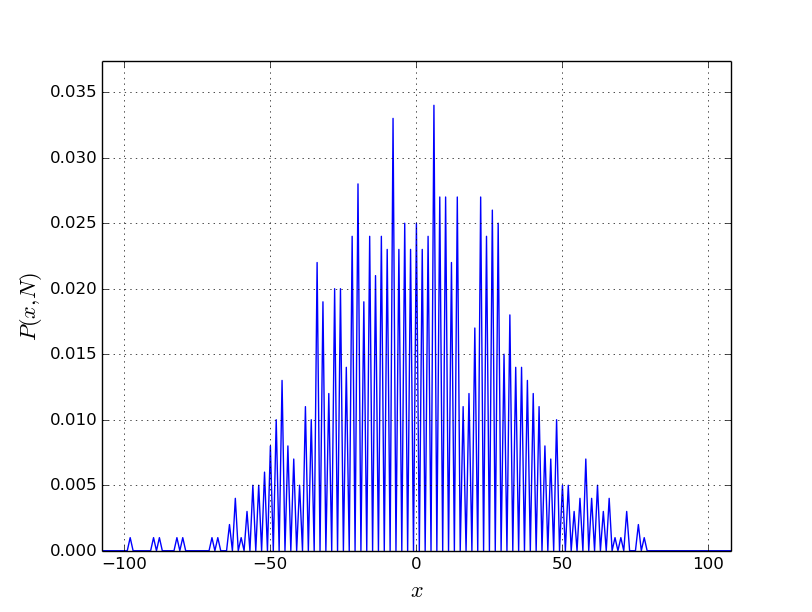
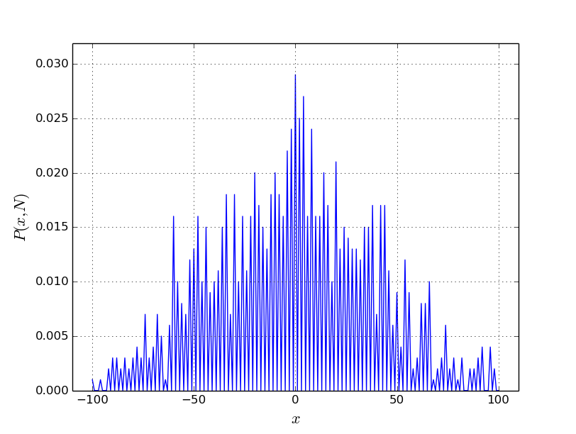
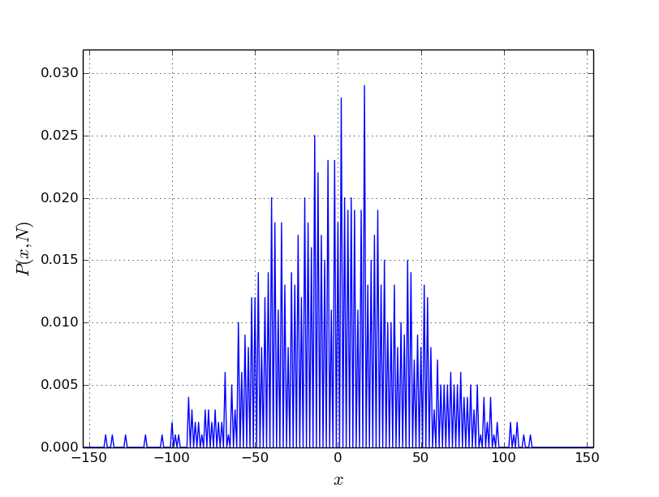
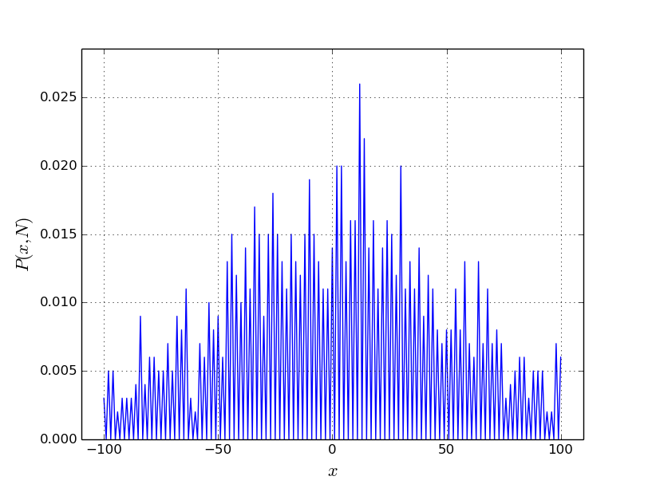

.. _12-5-label:

====================================================
問題12.5 - 制限されたランダムウォーク
====================================================

.. contents::

シミュレーションの目的
====================================================

いろいろなタイプの制限や境界がある場合に、それらがランダムウォークに与える効果をより一般的に議論する。

作成したプログラム
====================================================

本シミュレーションを行うにあたり作成したプログラムを以下に示す。

制限要素を含めた1次元のランダムウォーク(RestrictedRW.py)
--------------------------------------------------------------

このプログラムでは、1次元の格子上に、捕獲格子点や反射点を定義し、その中に初期値を設定した際のランダムウォークの性質を調べることができる。例えば、restricted_rw_eraseを用いると、捕獲格子点(粒子がその点に接触すると粒子が消滅する)を\ :math:`x=0,a`\ の位置に定義することができ、またrestricted_rw_reflectを用いると、\ :math:`x=-a,a`\ の位置に置いた場合をシミュレーションできる。前者に関しては、全ての粒子が消滅するまで計算を続けるように設定してあり、粒子の消滅した時間(ステップ数)はtauに記録されるようになっている。また、消滅した点に関しては、それ以後計算を行わない。後者ではステップ回数Nを明示的に与えて、その回数だけループが続くようにしてある。caluculate_probは\ :ref:`問題12.4 <12-4-label>`\ で用いたものとほぼ同様である。

* RestrictedRW.py(\ :download:`download <RestrictedRW.py>`\ )

.. literalinclude:: RestrictedRW.py
    :language: python
    :linenos:

制限要素を含めた1次元のランダムウォーク(12-5_restricted_rw.py)
---------------------------------------------------------------------

先のRestrictedRWを利用して実際に実行するプログラム。3Dグラフの描画や、条件を変えた際の振る舞いはどうなるかを調べることができる。

* 12-5_restricted_rw.py(\ :download:`download <12-5_restricted_rw.py>`\ )

.. literalinclude:: 12-5_restricted_rw.py
    :language: python
    :linenos:

実習課題
====================================================

a. \ :math:`x=0`\ と\ :math:`x=a(>0)`\ に"捕獲"格子点がある1次元格子を考える。粒子は位置\ :math:`x_{0}`\ (\ :math:`0<x_{0}<a`\ )から動き始め、隣接した左右の格子点に当確率で進むとする。粒子が捕獲格子点に到達すると粒子は消滅する。モンテカルロ・シミュレーションを行い、粒子が捕まえられるまでの平均ステップ数\ :math:`\tau`\ (第1経過時間)が

.. math:: \tau = (2D)^{-1}x_{0}(a-x_{0})

で与えられることを確かめよ。ここで\ :math:`D`\ は捕獲格子点がない場合の自己拡散係数であり、平均はすべてのランダムウォークについて行う。

:math:`x=0,a`\ に捕獲格子点のある1次元格子上で、粒子が捕らえられるまでの平均時間を算出する。粒子が左右に動く確率は等しく(\ :math:`\alpha=0.5`\ )、捕獲格子点に接触した粒子は消滅する。粒子の数(試行回数と見ても良い)を\ :math:`\mathrm{walker}=1000`\ としたとき、捕獲格子点の位置\ :math:`a`\ と出発地点\ :math:`x_{0}`\ (\ :math:`0<x_{0}<a`\ )に対する平均ステップ数\ :math:`\tau`\ を計算した。この計算をまとめて3次元空間にプロットした(\ :num:`図#fig-12-5-f1`\ )。横から見た\ :num:`図#fig-12-5-f2`\ を見るとわかりやすいが、\ :math:`\tau`\ は\ :math:`x_{0}`\ の2次で変化し、また\ :math:`a`\ の大きさには比例している。これらの結果から、捕獲格子点のないとときの自己拡散係数\ :math:`D`\ (\ :math:`D=0.5`\ )を用いて、\ :math:`\tau`\ は

.. math:: \tau = (2D)^{-1}x_{0}(a-x_{0})

で与えられることが確かめられる。

.. _fig-12-5-f1:

    
    捕獲格子点の位置\ :math:`a`\ と初期位置\ :math:`x_{0}`\ (\ :math:`0<x_{0}<a`\ )に対する平均ステップ数\ :math:`\tau`\ 

.. _fig-12-5-f2:

    
    \ :num:`図#fig-12-5-f1`\ を\ :math:`a`\ 軸と平行に\ :math:`a=0`\ から見た場合

b.  捕獲格子点のあるランダムウォークのモデルは、物性物理で重要な役割を担っている。例として固体中のエネルギー輸送についての次の理想化されたモデルを考える。固体を、 母体の格子点と捕獲格子点の2種類からなる格子とみなす。入射した光子は母体の格子点で吸収され、その母体分子を励起する。その時の励起エネルギー、すなわち励起子は、母体のどれか1つの隣接格子点にランダムに移り、最初の励起分子は基底状態に戻る。そのようにして励起子は捕獲格子点に達するまで格子中を動き回る。そこで励起子は捕らえられ、化学反応を起こす。

    このようなエネルギー輸送のモデルの簡単なものの1つに、格子上に捕獲格子点が周期的に配置された1次元格子モデルがある。捕獲格子点は規則的な間隔で配置されているので、無限に長い格子上のランダムウォークの問題はリング状の格子でのランダムウォークの問題に置き換えることができる。\ :math:`N`\ 個の母体の格子点、すなわち\ :math:`N`\ 個の非捕獲格子点と、1個の捕獲格子点からなるリングを考える。粒子がどの母体格子点から出発する確率も等しく、等しい確率で隣接格子点に移動する場合、平均生存時間\ :math:`\tau`\ (捕獲格子点に達するまでの平均のステップ数)の\ :math:`N`\ -依存性はどうなるか。追加のシミュレーションを行うのではなく、設問aの結果を使え。

設問aの結果をこの場合に当てはめて考えると、捕獲格子点の位置を\ :math:`x=0`\ と\ :math:`x=a=N+1`\ とすればよいので、平均生存時間\ :math:`\tau(x_{0},N)`\ は

.. math:: 
    \tau(x_{0}, N) &= \frac{1}{2D}x_{0}(a-x_{0}) \\
    &= (N+1)x_{0}-x_{0}^{2}
    
である。粒子がどの母体格子点から出発する確率も等しいので、\ :math:`x_{i}=i`\ (\ :math:`1 \le i \le N`\ )とすると

.. math:: 
    \tau(N) &= \frac{1}{N}\sum_{i=1}^{N}\left( (N+1)x_{0}-x_{i}^{2}\right) \\
    &= \frac{1}{N}\left[ (N+1)\sum_{i=1}^{N}x_{i}-\sum_{i=1}^{N}x_{i}^{2}\right] \\
    &= \frac{1}{N}\left[ (N+1)\frac{1}{2}N(N+1)-\frac{1}{6}N(N+1)(2N+1)\right] \\
    &= \frac{1}{6}(N+1)\left[ 3N+3-(2N+1)\right] \\
    &= \frac{1}{6}(N+1)(N+2)
    
と計算することができる。

c.  \ :math:`x=-a`\ と\ :math:`x=a`\ に反射格子点がある1次元格子を考える。たとえば、粒子が\ :math:`x=a`\ の反射点にくると、次のステップで\ :math:`x=a-1`\ に反射されるとする。粒子は\ :math:`t=0`\ に\ :math:`x=0`\ を出発し、等確率で隣接格子点に進むとする。モンテカルロ法のプログラムを書いて、\ :math:`N`\ ステップの後に粒子が\ :math:`x`\ の位置にいる確率\ :math:`P(x,N)`\ を求めよ。また、得られた\ :math:`P(x,N)`\ の形を、反射する"壁"のない場合と比較せよ。\ :math:`N`\ と\ :math:`a`\ が同程度の大きさのとき、これら2つの確率分布は区別できるか。どの\ :math:`N`\ の値で初めて、2つの分布を区別できるようになるか。

:math:`x=-a=-100`\ と\ :math:`x=a=100`\ に反射格子点があり、粒子が\ :math:`t=0`\ に\ :math:`x=0`\ を出発して、等確率で隣接格子点に進むとき、\ :math:`N`\ ステップの後に粒子が\ :math:`x`\ の位置にいる確率\ :math:`P(x,N)`\ を求めて、これを\ :num:`図#fig-12-5-f3`\ に示した(\ :math:`N=900`\ )。また、反射格子点のない場合にも同じようにして確率\ :math:`P(x,N)`\ を求めた(\ :num:`図#fig-12-5-f4`\ )。これらの図を比較したとき、反射格子点の有無を見分けることはできない。というのは、反射格子点のないときの確率\ :math:`P`\ の\ :math:`x`\ に対する広がりの大きさが100程度であり、これより大きい\ :math:`a`\ を設定したところで、そもそも到達できないためにグラフの形に差異は生まれない。初めて2つの分布を区別できるようになる\ :math:`N`\ の値は、正規分布において99％信頼区間を算出するときのように、標準偏差(今の場合\ :math:`\sigma=\sqrt N`\ )に2.56を掛けた値が100となるような\ :math:`N`\ であると考えられる。したがってこの方法で計算を行うと、およそ\ :math:`N=1600`\ で、\ :math:`P(x,N)`\ の面積の99％が\ :math:`-a`\ から\ :math:`a`\ の間に含まれることになり、このとき残りの1％が境界での反射の影響を受けることになる。実際に、\ :math:`N=1600`\ のときに反射格子点のある場合とない場合の2つの場合についてシミュレーションを行い、\ :num:`図#fig-12-5-f5`\ 、\ :num:`図#fig-12-5-f6`\ に示した。この2つの確率分布は区別することができると言えるだろう。また、これよりもさらにNが大きいときには、反射格子点の位置で折り返して重ねたものとなっていることも確認できる(\ :num:`図#fig-12-5-f7`\ )。

.. _fig-12-5-f3:

    
    \ :math:`N=900`\ のとき、\ :math:`x`\ に対する\ :math:`P(x,N)`\ のグラフ(反射格子点有:\ :math:`a=100`\ )

.. _fig-12-5-f4:

    
    \ :math:`N=900`\ のとき、\ :math:`x`\ に対する\ :math:`P(x,N)`\ のグラフ(反射格子点無)

.. _fig-12-5-f5:

    
    \ :math:`N=1600`\ のとき、\ :math:`x`\ に対する\ :math:`P(x,N)`\ のグラフ(反射格子点有:\ :math:`a=100`\ )

.. _fig-12-5-f6:

    
    \ :math:`N=1600`\ のとき、\ :math:`x`\ に対する\ :math:`P(x,N)`\ のグラフ(反射格子点無)

.. _fig-12-5-f7:

    
    \ :math:`N=2500`\ のとき、\ :math:`x`\ に対する\ :math:`P(x,N)`\ のグラフ(反射格子点有:\ :math:`a=100`\ )

まとめ
====================================================

制限を設けた場合のランダムウォークについて調べることができた。プログラムの内容に関しては、3Dプロットを試し、また数値計算に用いる行列の操作についていくつかの方法を学んだ。

参考文献
====================================================

* ハーベイ・ゴールド,ジャン・トボチニク,石川正勝・宮島佐介訳『計算物理学入門』,ピアソン・エデュケーション, 2000.

